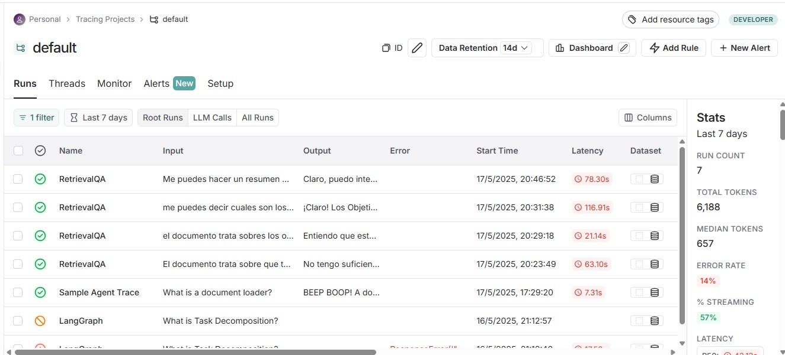

# 🤖 Chatbot RAG con Streamlit y Ollama

Este proyecto permite cargar un archivo PDF y hacerle preguntas en lenguaje natural, gracias a un sistema de recuperación aumentada con generación (RAG). Utiliza modelos locales servidos con [Ollama](https://ollama.com), embeddings, y una base vectorial con ChromaDB.

## 🔍 Características

- Carga de archivos PDF.
- División en fragmentos de texto.
- Vectorización con `nomic-embed-text`.
- Almacenamiento y búsqueda semántica con ChromaDB.
- Interfaz de chat estilo conversacional con Streamlit y `streamlit-chat`.
- Uso de LLMs locales a través de Ollama (`llama3`, etc).

## 🖼️ Ejemplos de Interfaz con el archivo 2344-8350-cient-28-00072.pdf ....
    - Pregunta: En el documento habla sobre control PID para el control de la temperatura y humedad del tabaco?
    - Respuesta: Sí, según el texto, el control PID (Proportional-Integral-Derivativo) se menciona como un método utilizado en la prueba 3 para controlar la temperatura y la humedad durante el proceso de curación y secado del tabaco. Se indica que una mejor sintonización del control PID sobre el lazo de temperatura, y una optimización del control del lazo de humedad (quizá con la implementación de un control PID sobre esta variable) podrían mejorar significativamente la calidad del tabaco Burley.

## 🖼️ Ejemplos de Interfaz con el archivo ODS Colombia Agenda de Desarrollo Post-2015.pdf
    - Pregunta: En este documento se mencionan los ODS? Cuales son?
            - Respuesta: Sí, en este documento se menciona la referencia a los Objetivos de Desarrollo Sostenible (ODS), que es un conjunto de objetivos globales establecidos por las Naciones Unidas para abordar los desafíos más importantes para el desarrollo sostenible.

            Los 17 Objetivos de Desarrollo Sostenible son:

            Erradicar la pobreza
            Hacer cumplir la ley y promover la justicia
            Poner fin a las desigualdades sexuales
            Asegurar una educación de calidad y promover la inclusión en el mercado laboral
            Agregar salud y promover el bienestar
            Acelerar el acceso a una energía limpia
            Garantizar la acción climática
            Proteger el océano, las costas e islands y promover la biodiversidad
            Fortalecer los sistemas de producción y consumo
            Reducir las desigualdades de género
            Fortalecer las ciudades y comunidades resilientes
            Asegurar una industria y un sistema productivos inclusivos e sostenibles
            Acción por el clima y la vida en el planeta
            Mantener vidas protegidas, saludables e hidratadas
            Promover inclusión, paz y justicia
            Hacer cumplir la ley y promover la transparencia y la buena gobernanza
            Fortalecer las redes de parques nacionales y los espacios naturales protegidos

            Espero que esta información sea útil. ¿Necesitas más detalles sobre algún objetivo específico?

## 🖼️ Pantallazos Langsmith
<p align="center">  </p> ```

---

## 📦 Requisitos

- Python 3.10 o superior
- [Ollama](https://ollama.com) instalado y funcionando localmente.
- Modelos descargados localmente (ver abajo).
- [Streamlit](https://streamlit.io) instalado.
- Acceso opcional a LangSmith para trazabilidad (opcional).

---

## ⚙️ Modelos necesarios en Ollama

Instala los siguientes modelos localmente ejecutando:

```bash
ollama pull nomic-embed-text
ollama pull llama3.2:latest
ollama pull gemma3:12b-it-qat
ollama pull deepseek-r1:latest


🚀 Instalación
Clona este repositorio:

git clone https://github.com/Colossus15/Chatbot_Streamlit.git
cd Chatbot_Streamlit
Crea un entorno virtual:

python -m venv venv
source venv/bin/activate  # En Windows: venv\Scripts\activate
Instala las dependencias:


pip install -r requirements.txt
🔐 Configuración
Crea un archivo .env en la raíz del proyecto, basado en el archivo .env.example:


LANGSMITH_API_KEY=tu_api_key_opcional
USER_AGENT=tu_user_agent_opcional
Estos campos son opcionales, usados solo si deseas trazabilidad con LangSmith.

▶️ Uso
Inicia Ollama en segundo plano si aún no está corriendo:

ollama serve
Ejecuta la aplicación con Streamlit:

streamlit run app.py
En la interfaz, selecciona el modelo de Ollama, sube tu archivo PDF y comienza a hacer preguntas.

📁 Estructura del proyecto

chatbot-rag-streamlit/
│
├── Chatbot.py                 # Código principal
├── requirements.txt       # Dependencias del proyecto
├── .env.example           # Variables de entorno de ejemplo
├── README.md              # Instrucciones de uso
├── .gitignore             # Archivos ignorados por Git
├── chroma_langchain_db/   # Base vectorial local (puede excluirse del repo)
├── Data
    └── 2344-8350-cient-28-00072.pdf
    └── ODS Colombia Agenda de Desarrollo Post-2015.pdf
└── Capturas
    ├── Captura_Langsmith.jpg
    └── Captura2_Langsmith.jpg


📬 Contacto
Para dudas, sugerencias o contribuciones, puedes abrir un issue o contacto directo vía GitHub.

